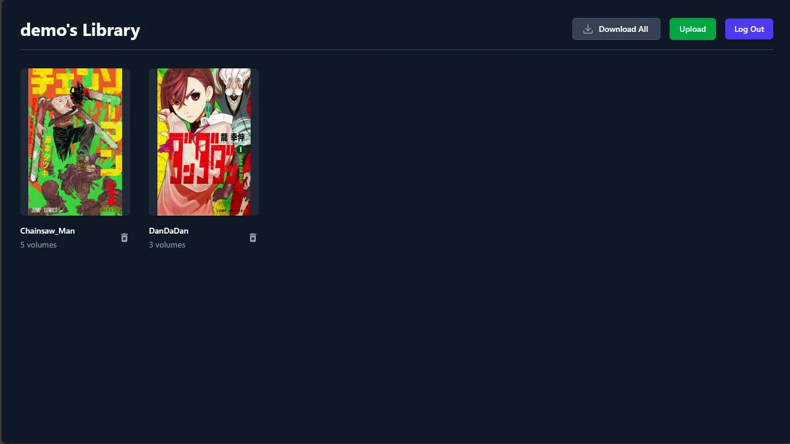
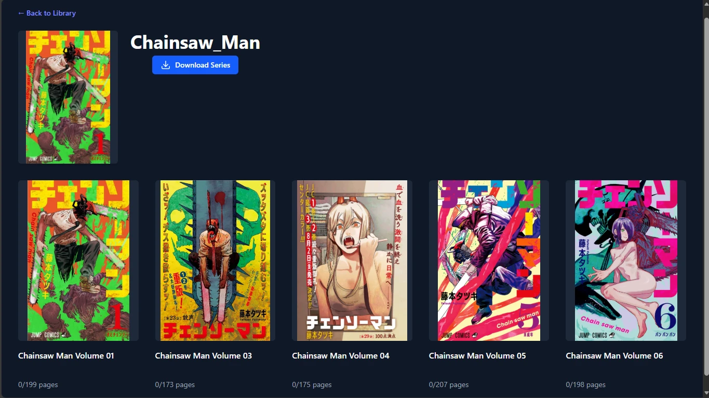

<div align="center">

# 📚 Mokuro Library

**A modern, self-hosted manga server for your [Mokuro](https://github.com/kha-white/mokuro)-processed library**

[](https://github.com/nguyenston/mokuro-library/stargazers)
[](LICENSE)
[](https://nguyenston.github.io/mokuro-library)

</div>

---

## ✨ What is Mokuro Library?

Mokuro Library transforms your Mokuro-processed manga into a **Plex-like streaming library**. It's a self-hosted, multi-user server application that runs on your NAS, home server, or local computer—giving you complete control over your manga collection with persistent reading progress, OCR editing, and seamless synchronization across all your devices.

<div align="center">
<table>
<tr>
<td align="center" width="50%">

**📖 The Library**


</td>
<td align="center" width="50%">

**📚 Series Management**


</td>
</tr>
</table>

**✏️ Live OCR Editing**


</div>

---

## 🚀 Key Features

| Feature | Description |
|---------|-------------|
| 📚 **Server-Side Library** | Upload entire Mokuro-processed directories—all files managed by the server |
| 👥 **Multi-User Support** | Separate accounts with individual progress, bookmarks, and settings |
| 📖 **Advanced Reader** | Single page, double page, and vertical scroll modes with persistent tracking |
| ✏️ **Live OCR Editing** | Edit text and bounding boxes in-browser—changes save directly to `.mokuro` files |
| 🔍 **Smart Organization** | Search, filter, sort, and organize your collection with metadata scraping |
| 💾 **Export Options** | Download as ZIP archives or PDFs with selectable text |
| 🌙 **Night Mode** | Color inversion and red shift for comfortable reading |
| 🐳 **Easy Deployment** | Single Docker container or Windows portable executable |

📖 **[View Full Feature List →](https://nguyenston.github.io/mokuro-library/#features)**

---

## 📦 Quick Start

### 🐳 Docker (Recommended)

```bash
# Clone and navigate
git clone https://github.com/nguyenston/mokuro-library.git
cd mokuro-library

# Build and run
docker compose build
docker compose up -d
```

**Access at:** `http://localhost:3001`

Your data will be stored in `./data` and `./data/uploads`

### 💻 Windows Portable

1. Download `MokuroLibrary-Windows.zip` from **[Releases](https://github.com/nguyenston/mokuro-library/releases)**
2. Extract and run `mokuro-library.exe`
3. Access at `http://localhost:3001`

---

## 📚 Documentation

**Full documentation is available at: [nguyenston.github.io/mokuro-library](https://nguyenston.github.io/mokuro-library)**

### Quick Links

- 🏁 [**Installation Guide**](https://nguyenston.github.io/mokuro-library/installation) - Docker, Windows, and deployment options
- 🔐 [**Authentication**](https://nguyenston.github.io/mokuro-library/authentication) - User management and security
- 📂 [**Managing Your Library**](https://nguyenston.github.io/mokuro-library/managing-your-library) - Upload, organize, and maintain your collection
- 📖 [**Using the Reader**](https://nguyenston.github.io/mokuro-library/using-the-reader) - Reading modes and features
- ✏️ [**OCR Editing**](https://nguyenston.github.io/mokuro-library/ocr-editing) - Edit and improve OCR text
- ⚙️ [**Settings**](https://nguyenston.github.io/mokuro-library/appearance-settings) - Customize your experience

---

## 💡 Why Mokuro Library?

### vs. [ZXY101/mokuro-reader](https://github.com/ZXY101/mokuro-reader) (Client-Side PWA)

| | **Mokuro Library** | **mokuro-reader** |
|-|-------------------|-------------------|
| **Architecture** | Self-hosted server | Browser-based PWA |
| **Storage** | Server filesystem + SQL database | Browser IndexedDB |
| **Multi-User** | ✅ Full support | ❌ Single user per browser |
| **Sync** | ✅ Automatic across devices | ☁️ Requires cloud storage (GDrive/MEGA) |
| **Library Size** | ♾️ Unlimited | ~2000 volumes (browser limits) |
| **OCR Edits** | ✅ Save to source files | ⚠️ Browser storage only |

**Choose mokuro-reader if:** You want zero-infrastructure setup with cloud sync
**Choose Mokuro Library if:** You self-host, need multi-user support, or have a large collection

---

## 🛠️ Tech Stack

- **Backend:** Node.js + Fastify
- **Frontend:** SvelteKit + TypeScript + Tailwind CSS
- **Database:** SQLite + Prisma ORM
- **Deployment:** Docker

---

## 🗺️ Roadmap

- [ ] **AnkiConnect Integration** - Sentence mining directly to Anki
- [ ] **Reading Stats Dashboard** - Visualize reading time and progress
- [ ] **CBZ Export** - Standard comic book archive format
- [ ] **Custom Keybindings** - User-defined keyboard shortcuts
- [ ] **OCR Version Control** - History/undo/redo for edits

---

## 🤝 Contributing

Contributions are welcome! Please feel free to submit a Pull Request.

---

## 📄 License

Released under the [MIT License](LICENSE).

---

## 🙏 Acknowledgements

Built with inspiration from [ZXY101/mokuro-reader](https://github.com/ZXY101/mokuro-reader) and powered by [Mokuro OCR](https://github.com/kha-white/mokuro).

---

<div align="center">

**[Documentation](https://nguyenston.github.io/mokuro-library)** • **[GitHub](https://github.com/nguyenston/mokuro-library)** • **[Issues](https://github.com/nguyenston/mokuro-library/issues)**

Made with ❤️ for manga readers

</div>